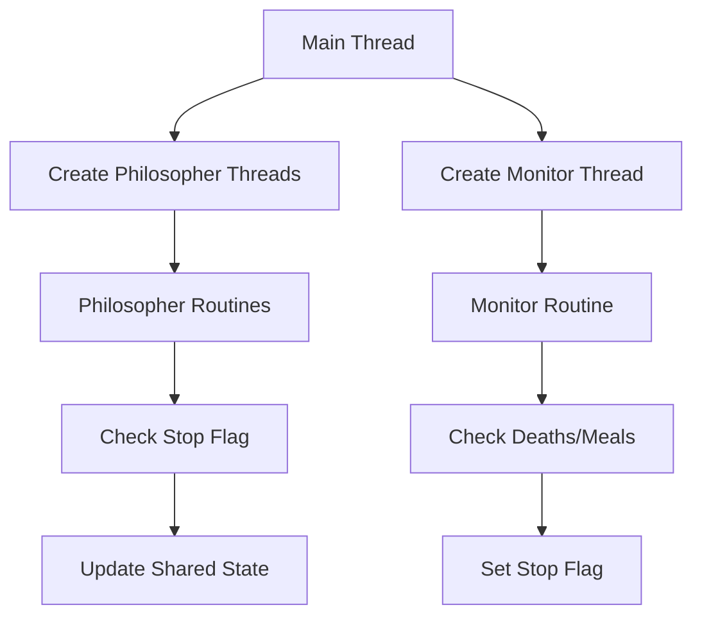

# Philosophers - 42 School Project

A multithreaded implementation of the classic dining philosophers problem using pthreads, featuring deadlock prevention and precise timing control.

## Overview

This project simulates multiple philosophers sitting at a table, alternating between thinking, eating, and sleeping. Each philosopher needs two forks to eat, and must avoid starvation while preventing deadlock situations. [1](#1-0) 

## Features

- **Thread-safe concurrency** using pthread mutexes
- **Deadlock prevention** through asymmetric fork acquisition
- **Precise timing** with custom usleep implementation
- **Death detection** via dedicated monitor thread
- **Meal counting** with optional completion criteria
- **Thread-safe logging** to prevent output corruption

## Architecture

### Core Data Structures

The simulation uses two primary structures:

**t_data** - Global configuration and shared state [2](#1-1) 
- Contains simulation parameters, mutex arrays, and timing values
- Manages global stop flag and philosopher array

**t_philo** - Individual philosopher state [3](#1-2) 
- Tracks meal timing, fork ownership, and personal statistics
- Contains pointers to shared data and adjacent forks

### Concurrency Model



## Compilation

```bash
make
```

The Makefile compiles all source files with strict compiler flags [4](#1-3) :
- `-Wall -Wextra -Werror` for strict error checking
- Links with `-lpthread` for pthread support

## Usage

```bash
./philo number_of_philosophers time_to_die time_to_eat time_to_sleep [number_of_times_each_philosopher_must_eat]
```

### Arguments
- `number_of_philosophers`: Number of philosophers/forks
- `time_to_die`: Milliseconds before philosopher dies without eating
- `time_to_eat`: Milliseconds spent eating
- `time_to_sleep`: Milliseconds spent sleeping
- `number_of_times_each_philosopher_must_eat` (optional): Simulation ends when all eat this many times

## Implementation Details

### Deadlock Prevention

The project uses asymmetric resource acquisition based on philosopher ID [5](#1-4) :
- **Even IDs**: Lock left fork first, then right fork
- **Odd IDs**: Lock right fork first, then left fork

### Monitor System

A dedicated monitor thread continuously checks [6](#1-5) :
- If any philosopher exceeded `time_to_die` since last meal
- If all philosophers completed required meal count
- Sets global stop flag to terminate simulation gracefully

### Thread-Safe Operations

Critical sections are protected by mutexes [7](#1-6) :
- `stop_mutex`: Protects global stop flag
- `print_mutex`: Prevents overlapping log messages
- `meal_mutex`: Per-philosopher protection for meal data
- `forks`: Array of mutexes representing physical forks

### Precise Timing

Custom `ft_usleep` implementation provides higher precision than standard `usleep` [8](#1-7)  by using busy-wait loops with small sleep increments.

## File Structure

- `philo.c` - Main program entry point and simulation runner [9](#1-8) 
- `philo.h` - Header with data structures and function declarations [10](#1-9) 
- `philo_logic.c` - Core philosopher logic and monitor routine [11](#1-10) 
- `philo_routine.c` - Philosopher actions (eat, sleep, think) [12](#1-11) 
- `philo_checks.c` - Thread-safe state checking and updating [13](#1-12) 
- `philo_inits.c` - Data structure initialization [14](#1-13) 
- `philo_parse.c` - Command line argument validation [15](#1-14) 
- `philo_utils.c` - Utility functions and timing [16](#1-15) 

## Notes

This implementation follows 42 School coding standards (Norminette) and uses only allowed functions. The project demonstrates understanding of pthread synchronization, deadlock prevention, and concurrent programming patterns.

---

## Notes

This README was generated based on the codebase structure and Glossary wiki page content. The current README.md in the repository contains only the project title [17](#1-16) .

Wiki pages you might want to explore:
- [Glossary (stick0789/Philosophers)](/wiki/stick0789/Philosophers#6)
